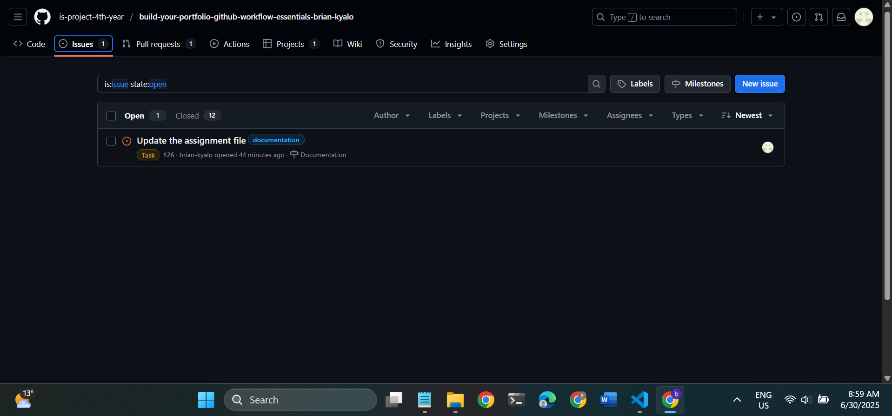
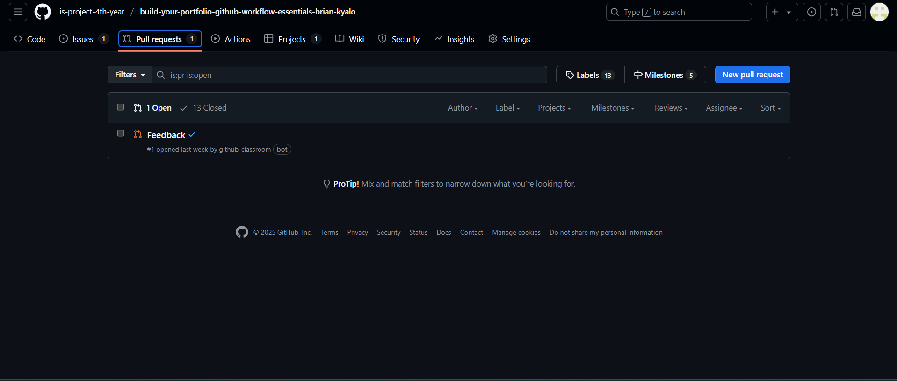
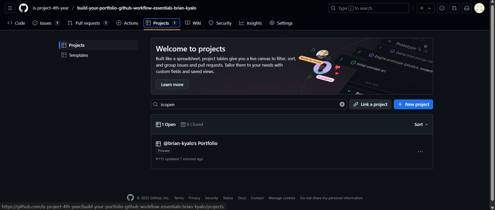
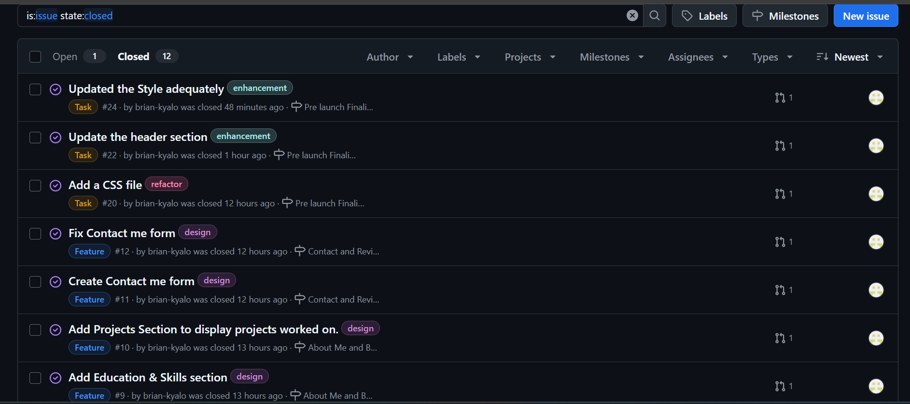
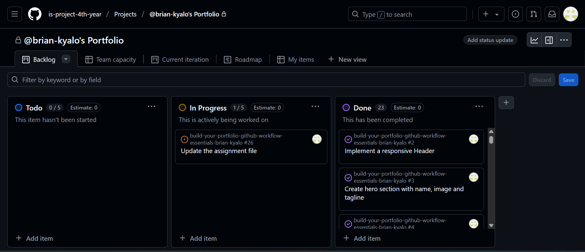
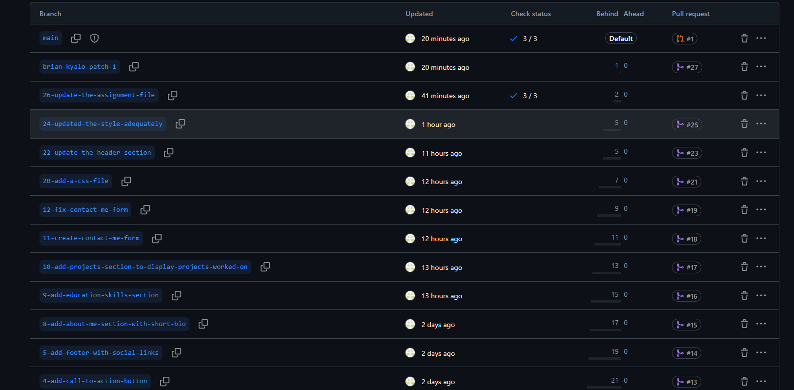
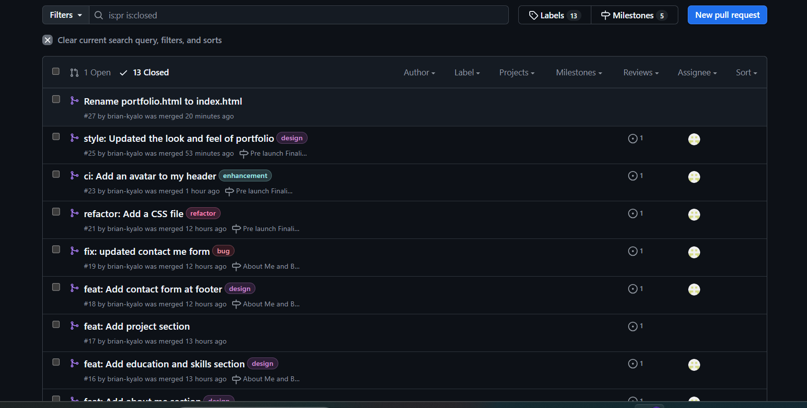
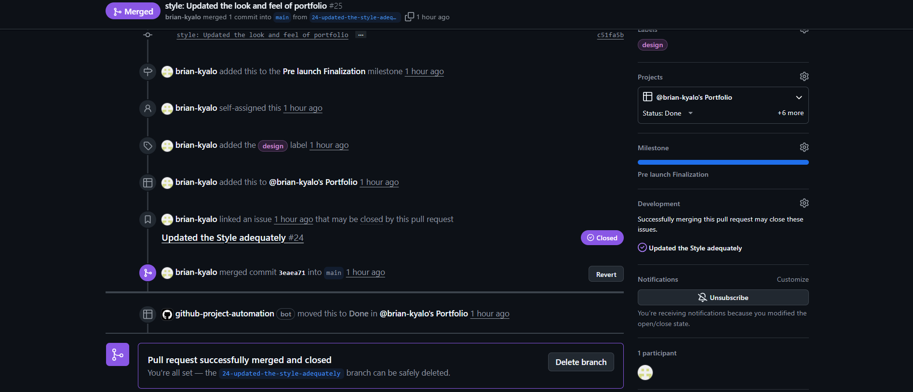

# Personal Portfolio Documentation

## 1. Student Details

- **Full Name**: Brian Kyalo Muthama
- **GitHub Username**: brian-kyalo
- **Email**: brian.kyalo@strathmore.edu

## 2. Deployed Portfolio Link

- **GitHub Pages URL**:  
https://is-project-4th-year.github.io/build-your-portfolio-github-workflow-essentials-brian-kyalo/

## 3. Learnings from the Git Crash Program

List at least **four key concepts or skills** you learned during the Git crash course. For each one, write a brief explanation of how it helped you manage your portfolio project more effectively.

- **Branching**:
Helped me work on different sections of the portfolio (like header, about, contact) independently. Prevented code conflicts by isolating features in separate branches.

- **Commit Conventions**:
Learning about conventional commits (like feat, ci, chore) made my Git history cleaner and easier to follow. I could track changes more efficiently.

- **Pull Requests (PRs)**:
Pull Requests allowed me to review changes before merging them into the main branch. This helped me maintain a clean and stable main branch.

- **Merge Conflict Resolution**:
I encountered and resolved a merge conflict during styling updates. This taught me how to confidently handle conflicts in both GitHub and locally using VS Code.


## 4. Screenshots of Key GitHub Features

Include screenshots that demonstrate how you used GitHub to manage your project. For each screenshot, write a short caption explaining what it shows.

> Upload the screenshots to your GitHub repository and reference them here using Markdown image syntax:
> (you could just simply copy and paste the image into the Assignment.md)

```markdown

```


This display the issues section which allows people working as a team or as an individual to track the development process by linking everything added (merged) to the main branch through creating issues and milstones.


This displays rulesets that determing how a repository will be handled this section enables you to set certain key rules that provide permissions to different users for example conducting a pull req before merging to the main branch.


Displays a the pull request section that shows open and closed requests and also through tags its able to link where each pull request came from (branch) and which issues and milstones the request is tied to.


This displays the project section with 3 colums todo, in progress and done. Helps developers see their progress. 

### A. Milestones and Issues
- Screenshot showing your milestone(s) and the issues linked to it.




### B. Project Board

- Screenshot of your GitHub Project Board with issues organized into columns (e.g., To Do, In Progress, Done).


### C. Branching

- Screenshot showing your branch list with meaningful naming.


### D. Pull Requests

- Screenshot of a pull request that’s either open or merged and linked to a related issue.


### E. Merge Conflict Resolution

- Screenshot of a resolved merge conflict (in a pull request, commit history, or your local terminal/GitHub Desktop).

